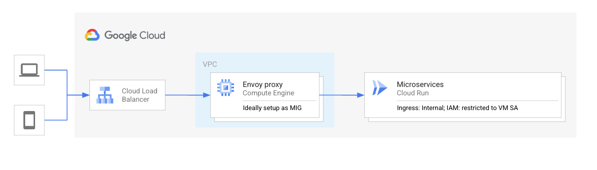

# Envoy Proxy with Cloud Run backend Example

This is a simple example for a envoy proxy, that act's as a reverse proxy in front of a Cloud Run service. The proxy adds a GCP IAM Identity Token to the request, hence acting as an authentication proxy. This is useful if there is for example domain restricted sharing enabled, and roles/run.invoker can't be enabled for allUsers.



To use this example update the <service_id> for your Cloud Run service and either run the container with
```sh
docker run -it --rm -p 8085:8085 -v `pwd`/envoy.yaml:/etc/envoy/envoy.yaml envoyproxy/envoy-dev:latest
```
or buid the container with `docker build -t <image> .`

The envoy proxy configuration, preserves the original `Authorization` header, by moving it to a new `X-Forwarded-Authorization` header.